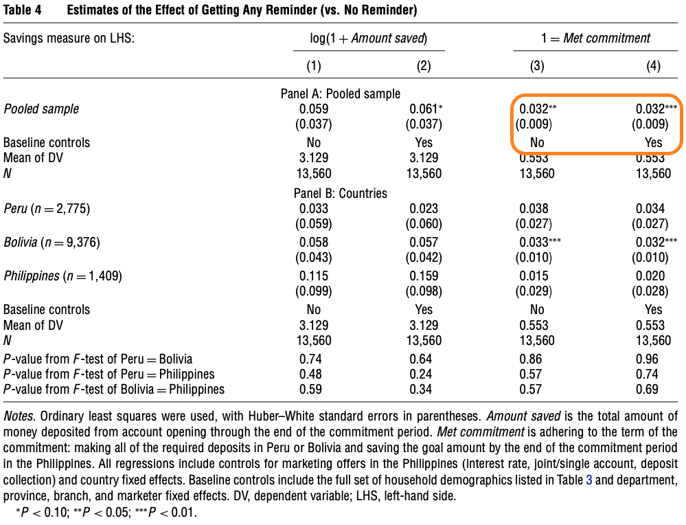

```{r load packages, message = FALSE}
library(tidyverse)

library(patchwork)
library(stargazer)

library(sandwich)
library(lmtest)
```

# 1. Simulated Data 

For this question, we are going to create data, and then estimate models on this simulated data. This allows us to effectively *know* the population parameters that we are trying to estimate. Consequently, we can reason about how well our models are doing. 

```{r create homoskedastic data function}
create_homoskedastic_data <- function(n = 100) { 
  
  d <- data.frame(id = 1:n) %>% 
    mutate(
      x1 = runif(n=n, min=0, max=10), 
      x2 = rnorm(n=n, mean=10, sd=2), 
      x3 = rnorm(n=n, mean=0, sd=2), 
      y  = .5 + 1*x1 + 0*x2 + .25*x3^2 + rnorm(n=n, mean=0, sd=1)
    )
  
  return(d)
}
```

```{r create first data}
d <- create_homoskedastic_data(n=100) 
```

1. Produce a plot of the distribution of the **outcome data**. This could be a histogram, a boxplot, a density plot, or whatever you think best communicates the distribution of the data. What do you note about this distribution? 

```{r distriution of outcome data, message = TRUE}
outcome_density <- d %>% 
  ggplot() + 
    aes(x = y) + 
    geom_density() 
outcome_density

```

> I chose a density plot to better visualize the distribution of the data. Looking at the graph above, the outcome data seems to be slightly skewed to the left. In other words, we can see that the highest density of our data points based on the model "y" lies roughly towards the center but slightly skewed left. 


2. Are the assumptions of the large-sample model met so that you can use an OLS regression to produce consistent estimates? 

> To apply the large-sample assumptions, we need to have greater or equal to 100 data points. We have n = 100, so therefore, we can use the Large-Sample Linear Model. As for the assumptions, there are two; I.I.D and a unique BLP should exists. In our case, IID is satisfied because the data is indepent and identically distributed. Looking at hte graph, we see a lot of similarities to normal distribution, therefore a Unique BLP exits. 


3. Estimate four models, called `model_1`, `model_2`,  `model_3` and `model_4` that have the following form:

\begin{align} 
  Y &= \beta_{0} + \beta_{1}x_{1} + 0 x_{2} + \beta_{3}x_{3} + \epsilon \\ 
  Y &= \beta_{0} + \beta_{1}x_{1} + \beta_{2}x_{2} + \beta_{3}x_{3} + \epsilon \\ 
  Y &= \beta_{0} + \beta_{1}x_{1} + \beta_{2}x_{2} + \beta_{3}x_{3}^{2} + \epsilon \\ 
  Y &= \beta_{0} + \beta_{1}x_{1} + \beta_{2}x_{2} + \beta_{3}x_{3} + \beta_{4}x_{3}^{2} + \epsilon
\end{align}

```{r}
# If you want to read about specifying statistical models, you can read 
# here: https://cran.r-project.org/doc/manuals/R-intro.html#Formulae-for-statistical-models'
# note, using the I() function is preferred over using poly() 

model_1 <- lm(y ~ x1 + x3, data =d) 
model_2 <- lm(y ~ x1 + x2 + x3, data =d)
model_3 <- lm(y ~ x1 + x2 + I(x3^2), data =d)
model_4 <- lm(y ~ x1 + x2 + x3 + I(x3^2), data =d)

```

Recall that *Foundations of Agnostic Statistics* used **MSE** as the evaluative criteria for population models. Use the plug-in analogue, the **Mean Squared Residual, MSR** in this sample. 

```{r define a function to compute MSR} 
calculate_msr <- function(model) { 
  # This function takes a model, and uses the `resid` function 
  # together with the definition of the msr to produce 
  # the MEAN of the squared residuals
  msr <- mean(resid(model)^2)
  return(msr)
} 

```

```{r}
calculate_msr(model_1)
calculate_msr(model_2)
calculate_msr(model_3)
calculate_msr(model_4)
```

3. Which of these models does the "best" job at estimating the population coefficients? 

> Model 1. 

4. Conduct two tests about $x_2$. 
  a. First, using `model_2` that you have estimated: conduct a wald-test (i.e. a t-test) for the coefficient $\beta_{2}$. What do you conclude from this sample about the relationship between $x_2$ and $y$? 
  
```{r}

coeftest(model_2, vcov = vcovHC(model_2, type='const'))


```
> After conducting the t-test for coefficient beta 2, we can cannot reject the null. In other words, x2 is not useful for predicting outcome for y. 
  
  
  b. Is there any evidence that the additional parameter that you have estimated in `model_2` makes make this second model more fully represent the true population? Conduct an F-test with the null hypothesis that `model_1` is the correct population model, and evaluate whether you should reject the null to instead conclude that `model_2` is more appropriate. 

```{r f-test for model_1 vs model_2} 
anova(model_2, model_1, test = 'F')
```

  
  c. In your own words, explain why the p-values for the tests that you have conducted in parts (a) and (b) are the same. Are these tests merely different ways of asking the same question of a model?
  
> In part a, we are computing a test for the size of coefficients for model_2. In part b, we are conducting the the to study whether introducing a new coefficient to our nested model, affect the outcome of y. Both part a and b are essentially looking at the coefficients and whether they are affecting the outcome of y. 


```{r clean up data}
# Although it isn't necessary, we're going to remove all the data objects that 
# you have created to this point so that you can start the next section with 
# clear data. 
rm(list = setdiff(ls(), 'calculate_msr'))
```

# 2. Real-World Data 

"Can timely reminders *nudge* people toward increased savings?" Dean Karlan, Margaret McConnell, Sendhil Mullainathan, and Jonathan Zinnman publised a paper in 2016 examining just this question. In this research, the authors recruited people living in Peru, Bolivia, and the Philippines to be a part of an experiment. Among those recruited, a randomly selected subset were sent SMS messages while others were not sent these messages. The authors compare savings rates between these two groups using OLS regressions. 

Please, take the time to read the following sections of the paper, called `./karlan_data/karlan_2016.pdf`. We are asking you to read this to provide context and understanding for the data analysis task. Please, read briefly (take no more than 15-20 minutes for this reading).  

1. The *Abstract*
2. The first five paragraphs of the *Introduction* (the last paragraph to read begins with, "Although the full pattern of our empirical results suggests..." )
3. Section 2: *Experimental Design* so you have a sense for where and how these experiments were conducted 
4. Table 2(a), 2(b), and 2(c) so you have a sense for what the SMS messages said to participants. 

The core results from this study are reported in Table 4. You can read this now, or when you are doing the data work to reproduce parts of Table 4 later in this homework. 

## A. Read the data 

Read in the data using the following code.

```{r, echo = TRUE, results='hide'} 
d <- haven::read_dta(file = './karlan_data/analysis_dataallcountries.dta')
glimpse(d)
```

## B (Optional). Conduct an F-test

(This part B is optional; the later part C is required.) 

One of the requirements of a data science experiment is that treatment be randomly assigned to experimental units. One method of assessing whether treatment was randomly assigned is to try and predict the treatment assignment. Here's the intuition: *it should not be possible to predict something random.*

The specifics of the testing method utilize an F-test. Here is how: 

- The data scientist first estimates a model that regresses treatment using only a regression intercept, $rem\_any \sim \beta_{0} + \epsilon_{short}$. In `lm()`, you can estimate this by writing `lm(rem_any ~ 1)`. 
- Then, the data scientist estimates a model that regresses treatment using all data available on hand, $rem\_any ~ \sim \beta_{0} + \beta_{1}x_{1} + \dots + \beta_{k}x_{k} + \epsilon_{long}$, where $x_{1} + \dots$ index all the additional variables to be tested.

To test whether the long model has explained more of the variance in $rem\_any$ than the short model, the data scientist then conducts an F-test for the long- vs. short-models. 

a. What is the null hypothesis for this F-test between a short- and long-model? 

> 'Fill in here: What is the null hypothesis?' 

b. What criteria would lead you to reject this null hypothesis? 

> 'Fill in here: What would lead you to reject this null hypothesis?' 

c. Using variables that indicate: 
  
  - sex (as noted in the codebook) (`female`); 
  - age (`age`); 
  - high school completion (`highschool_completed`); 
  - wealth (`wealthy`); 
  - marriage status (`married`); 
  - previous formal savings (`saved_formal`, which isn't in the codebook); 
  - weekly income (`inc_7d`);  
  - meeting savings goals (`saved_asmuch`)
  - and, spend before saving (`spent_b4isaved`)

  your team has conducted an F-test to evaluate whether there is evidence to call into question whether respondents in the *Philippines* were randomly assigned to receive any reminder (`rem_any`).   

```{r conduct F-test}
short_model <- lm(rem_any ~ 1, data = d[d$country == 3,])
long_model  <- lm(rem_any ~ female + age + highschool_completed + wealthy + 
                   married + saved_formal + inc_7d + saved_asmuch + 
                   spent_b4isaved, data = d[d$country == 3,])

anova(short_model, long_model, test = "F")
```

d. Do you reject or fail to reject the null hypothesis? 

> 'Fill in here: Do you reject or fail to reject the null hypothesis?' 

e. What do you conclude from this test? Do the additional covariates increase the model's ability to predict treatment? This is an example of using a "Golem" model for a specific task. 

> 'Fill in here: What do you conclude?' 

## C. Reproduce Table 4

There is **a lot** that is happening in Table 4 of this paper. In this part of the question, you will reproduce some parts of this table. First, reproduce the OLS regression estimates that are in the upper right of Table 4. That is, estimate effects of SMS message on meeting savings goals.



In Section 3.1 of the included paper, the authors describe the OLS model that they estimate: 

$$
  Y_{i} = \alpha + \beta R_{i} + \gamma Z_{i} + \epsilon_{i}
$$

For the upper right panel that you are estimating, the outcome, $Y_{i}$ is a binary indicator for whether the individual met their savings goal. The indicator $R_{i}$ is a binary indicator for whether the individual was assigned to receive a reminder. And, $Z_{i}$ is a vector of additional features: a categorical variable for the country, and a binary indicator for whether the individual was recruited by a marketer. In the model labeled (3) only $Y$, $R$ and $Z$ are used in the regression. In the model labeled (4) these variables are used, but so too are the other variables that you previously used in the F-test. 

a. Examining the data, and any information provided by the authors in the paper, evaluate the assumptions for the large-sample linear model. Are the necessary assumptions met for this regression model to produce consistent estimates (i.e. estimates that converge in probability to the population values)? Why or why not? 

> There are two assumptions for large-sample Model. The data has to be I.I.D. and a Unique BLP should exists. The aggragate of the data is not entirely IID and the study does mention this as "Cross-site differences in setting and nonrandomized features motivate estimating site-specific treatment effects as well." However, the samples are IID when it comes to site specific samples. The sample is sufficiently large and the model being a linear model points to the data having a unique BLP. I would be comfortable running a regression on each site separately, but not the aggragate (pooled).

b. The authors have concluded that they can conduct these regressions. So, in the next code chunk, please conduct these regressions. First, estimate the model that is reported in model (3). You will have to read the notes below Table 4 to get exactly the correct covariate set that reproduces the reported estimates. Then, estimate the model that is reported in model (4). 

```{r build out regressions}
mod_pooled_no_covariates   <- lm(reached_b4goal ~ rem_any + country + marketer, data = d)
mod_pooled_with_covariates <- lm(reached_b4goal ~ rem_any + country + marketer + female + age + 
                                   highschool_completed + wealthy + married + saved_formal +
                                    inc_7d + saved_asmuch + spent_b4isaved + depart + provincia + 
                                   branch + joint + joint_single + dc + highint + rewardint, data = d) 
```


 
Once you have estimated these models, you can print them to the screen using the `stargazer` package. 

```{r print model estimates, warning = FALSE}
library(stargazer)
## while you are writing you code, you can use `type = 'text'` to print to the console
stargazer(mod_pooled_no_covariates, 
   type = 'text', header = FALSE, 
   star.cutoffs = c(0.05, 0.01, 0.001) # the default isn't in line with w203
)
```

```{r print model estimates in latex, warning = FALSE, results = 'asis'}
library(stargazer)
## while you are writing you code, you can use `type = 'text'` to print to the console
stargazer(mod_pooled_with_covariates, 
   type = 'text', header = FALSE, 
   star.cutoffs = c(0.05, 0.01, 0.001) # the default isn't in line with w203
)
```

c. Does the addition of the covariates improve the fit of the model? First, compute the MSR for each model (you can use methods from the first question, either `augment` or `resid`). Then, conduct an F-test to evaluate. 


```{r compute MSE for the short and long models; ensure you print these values to the screen}
mean_squared_residual_no_covariates   <- mean(resid(mod_pooled_no_covariates)^2)
mean_squared_residual_with_covariates <- mean(resid(mod_pooled_with_covariates)^2)
mean_squared_residual_no_covariates
mean_squared_residual_with_covariates
```

The mean squared residuals of the short model are, `r mean_squared_residual_no_covariates`. The mean squared residuals of the long model are `r mean_squared_residual_with_covariates`. In the next chunk, we test whether the MSRs of the models are different. 

```{r test whether covariates improve the model}
f_test_of_long_vs_short <- anova(mod_pooled_with_covariates, mod_pooled_no_covariates, test = 'F')
f_test_of_long_vs_short
```

> It looks like the introduction of covariates does improve the fit of the model. My null hypothesis was that introducing the covariates does not affect the outcome, however running the F test and looking at the p-value, we can reject the null hypothesis. 

d. The authors report that they used Huber-White standard errors. That is to say, they used robust standard errors. Use the function `vcovHC` -- the variance-covariance matrix that is heteroskedastic consistent -- from the `sandwich` package, together with the `coeftest` function from the `lmtest` package to print a table for each of these regressions. 

```{r print regression tables with robust standard errors} 
# you can uncomment the following line to conduct a test with robust standard errors
# 
coeftest(mod_pooled_no_covariates, vcovHC)
coeftest(mod_pooled_with_covariates, vcovHC)
```

e. For each of the coefficients in the table you have just printed, there is a p-value reported: This is a p-value for a hypothesis test that has a null hypothesis. What is the null hypothesis for each of these tests? 

> The null hypothesis is that each of those coefficients have no effect on the outcome of our model. We can see from our table that we can reject the null for some and fail to reject others.  

f. Suppose that your criteria for rejecting the null hypothesis were: "The p-value must be smaller than 0.05". Then, which of these coefficients rejects that null hypothesis? (Keep only one of the options in the "Determination" column of the table below.)

> | Variable               | Determination   | 
> |------------------------|-----------------|
> | `rem_any`              | Significant     |
> | `marketer`             | Significant     |
> | Lives in Bolivia       | Not Significant |
> | Lives in Peru          | Not Significant |
> | `female`               | Significant     | 
> | `age`                  | Significant     | 
> | `highschool_completed` | Not Significant | 
> | `wealth`               | Significant     |  
> | `married`              | Significant     | 
> | `saved_formal`         | Significant     | 
> | `inc_7d`               | Not Significant |  
> | `saved_asmuch`         | Not Significant | 
> | `spent_b4isaved`       | Not Significant | 

g. Interpret the meaning of the coefficient estimated on the `rem_any`. (We will talk about this more in a later unit, but this is the treatment effect from this experiment). 

> rem_any means "randomly assigned to any mail or SMS message". This coefficient means that randomly assigning to any email or SMS does effect the outcome of our model due to it having a significant p-value. 

h. Interpret the meaning of the coefficient estimated on `age`. 

> Age coefficient means that age does effect the outcome of our model due to it have a significant p-value. 

i. Interpret the meaning of the coefficient estimated on `highschool_completed`. 

> This coefficient means having completed the high school does not effect the outcome of our model due to it having a NOT significant p-value. 